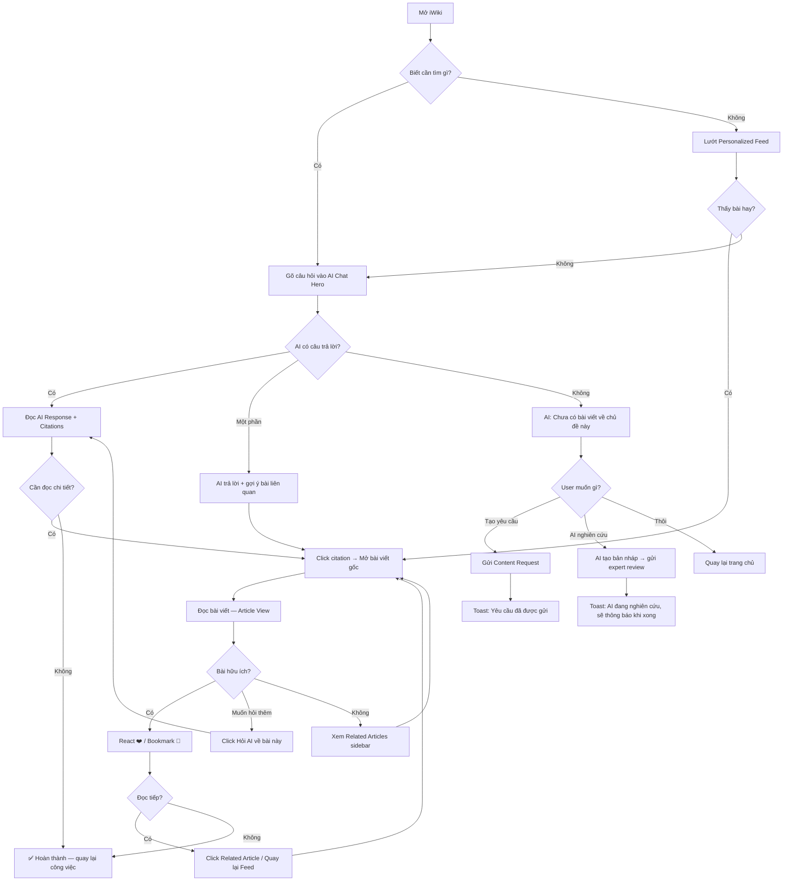
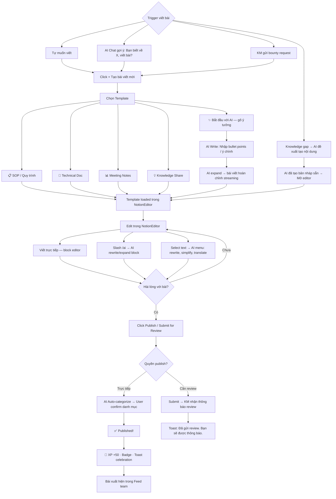
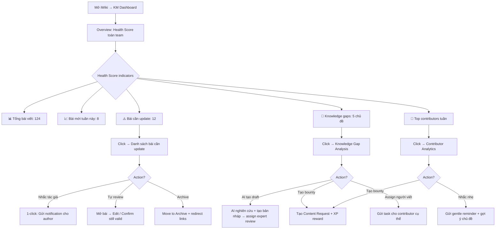

# UX Design Specification — iWiki Knowledge Hub 4.0

**Author:** Tom
**Date:** 2026-03-23

---

<!-- UX design content will be appended sequentially through collaborative workflow steps -->

## Executive Summary

### Tầm nhìn Dự án

iWiki 4.0 không chỉ là nâng cấp giao diện — mà là cuộc cách mạng về **trải nghiệm tri thức** tại iKame. Mục tiêu: biến iWiki từ "kho tài liệu không ai dùng" thành **nơi đầu tiên mọi người nghĩ đến** khi cần tìm thông tin nội bộ.

**Đối thủ thật sự của iWiki không phải Confluence hay Notion** — mà là:
1. **Hỏi đồng nghiệp** (zero friction, tức thì, tin cậy)
2. **Google / ChatGPT / Gemini** (nhanh, thông minh, luôn có sẵn)

Để thắng, iWiki phải đạt 3 tiêu chuẩn:
- **Nhanh hơn hỏi người** — AI Chatbot trả lời trong 2 giây với context iKame mà ChatGPT không có
- **Dễ hơn Google** — Search hiểu tiếng Việt, hiểu thuật ngữ nội bộ, trả kết quả chính xác
- **Đáng làm hơn ngồi viết** — AI Write + Template + Gamification biến "viết bài" từ gánh nặng thành thành tựu

### Người dùng Mục tiêu

**Viewer — "Linh" (200+ nhân sự, đặc biệt nhân sự mới)**
- **Hành vi hiện tại:** Hỏi đồng nghiệp trước → Google/ChatGPT → iWiki là lựa chọn cuối cùng (nếu có)
- **Rào cản:** iWiki chậm, search kém, không có lý do quay lại
- **UX Goal:** iWiki phải **nhanh hơn hỏi người** — mở lên, thấy ngay nội dung cần đọc, hỏi AI được trả lời tức thì
- **"Wow moment":** Trang chủ đã cá nhân hóa sẵn — nội dung "dành cho bạn" ngay trước mắt, không cần tìm kiếm
- **Device:** Desktop tại office (100% office-based, chưa có thói quen dùng iWiki)

**Contributor — "Huy" (Chuyên gia, Senior, Manager)**
- **Hành vi hiện tại:** Biết nhiều nhưng không viết. Khi được yêu cầu thì viết miễn cưỡng.
- **Rào cản chính: KHÔNG PHẢI EDITOR** — mà là "không biết viết gì" + "không thấy giá trị" + "thiếu động lực"
- **UX Goal:** Giảm friction tối đa — template gợi ý cấu trúc, AI viết hộ, quy trình duyệt nhanh, gamification tạo động lực
- **"Wow moment":** Chọn template → gõ bullet points → AI biến thành bài viết hoàn chỉnh trong 5 phút → cảm giác "mình viết được bài hay thật"

**Knowledge Manager — "Thảo" (Trưởng bộ phận, L&OD)**
- **Hành vi hiện tại:** KHÔNG QUẢN LÝ nội dung. Không có công cụ, không có quy trình, không có dashboard.
- **Rào cản:** Không nhìn thấy được bức tranh toàn cảnh tri thức của team
- **UX Goal:** 1 dashboard duy nhất — thấy được: bài nào cần cập nhật, team đang tìm gì mà không có, ai đang đóng góp
- **"Wow moment":** Mở dashboard lần đầu → thấy rõ "tri thức team tôi đang ở đâu" — chưa bao giờ có công cụ này

### Thách thức Thiết kế Chính

**DC1: Cạnh tranh với "Zero Friction" của việc hỏi đồng nghiệp**
Hỏi người = 0 bước, 0 loading, có ngay câu trả lời. iWiki phải giảm friction xuống gần = 0: trang chủ đã sẵn nội dung, AI Chat ngay trên giao diện, search instant. Mỗi giây chậm trễ là mất 1 người dùng.

**DC2: Tạo động lực đóng góp khi người dùng KHÔNG THẤY GIÁ TRỊ**
Vấn đề không phải UX editor mà là tâm lý: "ai đọc bài tôi viết?". Cần hiển thị BẰNG CHỨNG giá trị: số lượt đọc, ai đã đọc, badge, XP, leaderboard. Contributor phải CẢM NHẬN được contribution của mình được ghi nhận.

**DC3: Progressive enhancement — nâng cấp mà không làm mất sự quen thuộc**
200 người dùng đang có. Thay đổi quá nhiều = confused. Phải giữ navigation structure quen thuộc, chỉ nâng cấp visual và thêm tính năng từng bước. Feature flags cho gradual rollout.

**DC4: Migration từ Ant Design sang @frontend-team/ui-kit**
Hiện tại đang dùng Ant Design + 4 phương pháp CSS khác nhau. Cần chuyển sang ui-kit thống nhất mà không phá vỡ giao diện giữa chừng. Kế hoạch migration từng component, không big-bang.

**DC5: Từ "không có thói quen" đến "thói quen hàng ngày"**
100% office-based nhưng không ai có thói quen mở iWiki. Cần tạo "hook" — lý do quay lại mỗi ngày: personalized feed, AI chat, gamification notifications, "bài mới trong space của bạn".

### Cơ hội Thiết kế

**DO1: AI Chat như "đồng nghiệp thông thái" — đối thủ thực sự của việc hỏi người**
Thay vì search → đọc bài → tìm câu trả lời, user chỉ cần hỏi AI 1 câu và được trả lời tức thì với nguồn trích dẫn. Đây là UX leap — từ "document repository" thành "knowledge assistant". Nếu làm tốt, đây là lý do #1 người dùng chọn iWiki thay vì hỏi đồng nghiệp.

**DO2: "First 5 Minutes" — Trang chủ cá nhân hóa tạo ấn tượng đầu tiên**
Trang chủ không phải dashboard chung chung mà là **bản tin cá nhân** — nội dung theo role, BU, lịch sử đọc, xu hướng trong team. Mỗi lần mở iWiki = thấy ngay điều gì đó hữu ích.

**DO3: "Viết bài = Thành tựu" — Gamification + AI Write tạo vòng lặp tích cực**
Kết hợp AI Write (giảm friction) + Gamification (tăng động lực) + Social proof (hiển thị số đọc, likes) để tạo vòng lặp: viết dễ → được ghi nhận → thấy người đọc → muốn viết tiếp. Đây là cách phá vỡ "vòng xoáy đi xuống".

**DO4: Knowledge Manager Dashboard — Công cụ chưa từng tồn tại**
Hiện tại KM không có bất kỳ công cụ nào. Tạo dashboard đầu tiên = giá trị cực lớn với effort vừa phải. KM sẽ trở thành "champion" tích cực nhất vì họ nhìn thấy được giá trị ngay lập tức.

## Trải nghiệm Người dùng Cốt lõi

### Trải nghiệm Xác định (Defining Experience)

**Hành động chính:** Đọc bài viết chiếm ~80% thời gian sử dụng. Mọi quyết định UX phải tối ưu cho trải nghiệm đọc — load nhanh, typography rõ ràng, navigation mượt, nội dung liên quan gợi ý ngay.

**Trải nghiệm cốt lõi #1: "Đúc kết Tri thức Thông minh" (Smart Knowledge Distillation)**

Nếu chỉ được làm xuất sắc MỘT điều — đó là tích hợp AI hỗ trợ toàn bộ vòng đời tri thức:

| Giai đoạn | AI Hỗ trợ | Ví dụ |
|---|---|---|
| **Tìm kiếm** | Semantic Search + AI Chat trả lời tức thì | "Quy trình deploy production?" → AI trả lời 3 bước + link nguồn |
| **Nghiên cứu** | AI Research từ kho tri thức iKame + nguồn ngoài | User yêu cầu → AI tổng hợp từ nhiều bài viết liên quan |
| **Viết bài** | AI Write theo chuẩn iKame, dựa trên knowledge base | Bullet points → bài viết hoàn chỉnh theo template iKame |
| **Lấp khoảng trống** | AI tự phát hiện knowledge gap và đề xuất tạo nội dung | Search fail → "Chưa có bài viết. Muốn AI nghiên cứu và tạo bản nháp?" |

**Core Loop:** Tìm → Đọc → Áp dụng → Đóng góp lại → Được ghi nhận → Tìm tiếp

### Chiến lược Nền tảng (Platform Strategy)

| Quyết định | Giá trị | Lý do |
|---|---|---|
| **Platform** | Web Application (SPA) — Desktop-first | 100% office-based, chưa có thói quen mobile |
| **Interaction** | Mouse/keyboard primary | Laptop/desktop tại văn phòng |
| **Responsive** | Desktop (≥1280px) primary, Tablet (768-1279px) functional, Mobile (≤767px) read + search + AI chat only | Không cần mobile editor |
| **Offline** | Không cần | Office = luôn có mạng |
| **Component Library** | @frontend-team/ui-kit (thay thế Ant Design) | Thống nhất design system toàn iKame |
| **Editor** | @frontend-team/tiptap-kit NotionEditor (thay thế BlockNote) | Trải nghiệm viết giống Notion, tích hợp AI Write |
| **Browser** | Chrome primary (chuẩn iKame) | Tối ưu cho 1 browser = ship nhanh hơn |

### Tương tác Không Ma sát (Effortless Interactions)

**E1: Trang chủ cá nhân hóa — Zero Search Required**
Mở iWiki = nội dung cần đọc đã ở ngay trước mắt. Hệ thống tự gợi ý dựa trên: role, BU, lịch sử đọc, xu hướng team, bài mới trong space. Người dùng KHÔNG CẦN search để tìm nội dung hay — nó tự đến.

**E2: AI Chat — Hỏi như hỏi đồng nghiệp**
Ô chat luôn visible (không cần tìm). Gõ câu hỏi bằng ngôn ngữ tự nhiên tiếng Việt → trả lời trong 2-3 giây + trích dẫn nguồn. Nếu không có câu trả lời → đề xuất tạo nội dung mới.

**E3: AI Write — Từ ý tưởng đến bài viết trong 5 phút**
Chọn template → gõ bullet points → AI expand thành bài hoàn chỉnh theo chuẩn iKame. Không cần biết "viết gì" — template và AI hướng dẫn từng bước.

**E4: Auto-categorization — Không cần phân loại thủ công**
Hệ thống tự đề xuất danh mục khi tạo bài mới. AI phân tích nội dung và gợi ý taxonomy phù hợp. Knowledge Manager chỉ cần xác nhận, không cần sắp xếp thủ công.

**E5: Knowledge Gap Auto-fill — iWiki tự lấp khoảng trống**
Khi search term không có kết quả hoặc user request → AI tự nghiên cứu từ kho tri thức iKame + nguồn bên ngoài → tạo bản nháp → gửi chuyên gia review. Knowledge gap được lấp đầy chủ động.

### Khoảnh khắc Thành công Quyết định (Critical Success Moments)

**CSM1: "Tìm được — trong 10 giây" (Viewer)**
Khoảnh khắc: User search hoặc hỏi AI → nhận câu trả lời chính xác trong <10 giây.
Nếu thất bại: User quay lại hỏi đồng nghiệp/ChatGPT → mất niềm tin vĩnh viễn.
Thiết kế: Search instant, AI Chat visible, kết quả có snippet rõ ràng.

**CSM2: "Kiến thức này áp dụng được!" (Tất cả personas)**
Khoảnh khắc: User đọc bài trên iWiki → áp dụng thành công vào công việc thực tế.
Đây là khoảnh khắc QUYẾT ĐỊNH — iWiki chứng minh giá trị THẬT, không phải lý thuyết.
Thiết kế: Nội dung chất lượng cao (AI + templates chuẩn), actionable format, ví dụ thực tế.

**CSM3: "Mình viết được bài hay thật!" (Contributor)**
Khoảnh khắc: Contributor thấy AI biến bullet points thành bài viết mạch lạc → cảm giác "mình viết được".
Nếu thất bại: AI output kém → contributor mất niềm tin vào tool → quay lại không viết.
Thiết kế: AI Write output chất lượng cao, theo chuẩn iKame, editable dễ dàng.

**CSM4: "Lần đầu có tool quản lý tri thức!" (Knowledge Manager)**
Khoảnh khắc: KM mở dashboard → thấy toàn cảnh tri thức team lần đầu tiên.
Thiết kế: Dashboard rõ ràng, actionable insights, 1-click actions (nhắc tác giả, tạo bounty).

### Nguyên tắc Trải nghiệm (Experience Principles)

**EP1: "Nhanh hơn hỏi người" — Tốc độ là tính năng #1**
Mọi interaction path phải nhanh hơn alternative (hỏi đồng nghiệp, Google). Nếu search mất >3 giây, user đã mở tab ChatGPT. Page load <2s, search <500ms, AI response first token <3s.

**EP2: "Nội dung đến với bạn" — Proactive, không Reactive**
Không đợi user search — trang chủ cá nhân hóa, notification khi có bài mới liên quan, AI đề xuất nội dung. iWiki là "bản tin tri thức cá nhân" chứ không phải "kho lưu trữ".

**EP3: "AI là trợ lý, không phải thay thế" — Human-in-the-loop**
AI research, viết draft, gợi ý — nhưng chuyên gia luôn review và phê duyệt. AI nâng cao năng lực con người, không thay thế judgment. Mọi AI output phải trích dẫn nguồn.

**EP4: "Quen mà mới" — Progressive Enhancement**
Giữ navigation structure và layout quen thuộc. Nâng cấp visual, thêm tính năng mới từng bước. Người dùng cũ không bị "lạc", người dùng mới thấy hiện đại.

**EP5: "Đóng góp = Được ghi nhận" — Visible Value**
Mỗi contribution phải có feedback loop rõ ràng: số lượt đọc, likes, XP, badges. Contributor phải CẢM NHẬN được giá trị mình tạo ra. Không ai viết bài vào "hố đen".

## Phản hồi Cảm xúc Mong muốn

### Mục tiêu Cảm xúc Chính

**Cảm xúc #1: HÀO HỨNG — "Wow, cái này xịn thật!"**
Khi mở iWiki 4.0, người dùng phải cảm thấy hào hứng — không phải vì giao diện flashy mà vì NỘI DUNG ĐÚNG THỨ HỌ CẦN đã ở ngay trước mắt. Hào hứng vì hệ thống "hiểu mình", vì AI trả lời thông minh, vì mọi thứ nhanh và mượt.

**Cảm xúc #2: TỰ HÀO — "Mình làm được điều này!"**
Sau khi hoàn thành task (tìm được thông tin, viết xong bài, quản lý xong tri thức), người dùng phải cảm thấy tự hào — tự hào vì tự giải quyết được vấn đề, tự hào vì viết được bài hay, tự hào vì đóng góp được cho tổ chức.

**Cảm xúc #3: TIN TƯỞNG TUYỆT ĐỐI — "Hệ thống sẽ hoàn thiện thôi"**
Khi gặp lỗi (search không có kết quả, AI chưa chính xác), người dùng vẫn tin tưởng vì tổng thể trải nghiệm đã quá tốt. Không phải "sản phẩm hỏng" mà là "đang ngày càng tốt hơn". Giống tâm lý dùng sản phẩm yêu thích — lỗi nhỏ không phá vỡ niềm tin.

### Bản đồ Cảm xúc theo Hành trình

| Giai đoạn | Cảm xúc Mong muốn | Thiết kế Hỗ trợ |
|---|---|---|
| **Mở iWiki lần đầu** | Hào hứng + Ngạc nhiên | Trang chủ cá nhân hóa — "Hệ thống biết mình cần gì!" |
| **Tìm kiếm / Hỏi AI** | Tin tưởng + Ấn tượng | Kết quả chính xác <3s, AI trả lời tự nhiên + trích dẫn nguồn |
| **Đọc bài viết** | Tập trung + Hữu ích | Typography sạch, layout thoáng, nội dung actionable |
| **Viết bài với AI** | Tự hào + Ngạc nhiên | AI biến bullet → bài hoàn chỉnh, cảm giác "mình viết được bài hay" |
| **Bài được publish** | Tự hào + Được ghi nhận | Thông báo, số lượt đọc, XP, badge — feedback loop tức thì |
| **Gặp lỗi / Không có kết quả** | Bình tĩnh + Tin tưởng | "Chưa có bài viết — AI đang nghiên cứu giúp bạn", không bao giờ dead-end |
| **Quay lại lần 2, 3, n** | Quen thuộc + Hào hứng nhẹ | Feed mới mỗi ngày, progress cá nhân, "có gì mới cho bạn" |

### Vi Cảm xúc Quan trọng

**Cần ĐẠT ĐƯỢC:**

| Vi cảm xúc | Tại sao | Thiết kế |
|---|---|---|
| **Tự tin** | User tự giải quyết vấn đề = không phải "hỏi ngu" | AI Chat + Search chính xác → "Tôi tìm được rồi!" |
| **Năng lực** | Contributor cảm thấy mình viết được bài hay | AI Write nâng chất lượng output → tự hào về sản phẩm |
| **Nắm quyền** | KM lần đầu có công cụ → cảm giác kiểm soát | Dashboard rõ ràng, 1-click actions |
| **Thuộc về** | Đóng góp → thấy mình là một phần của cộng đồng tri thức | Leaderboard, badges, comments, reactions |
| **An tâm** | Mọi thứ được lưu, không mất data, có undo | Auto-save tin cậy, Recycle Bin, version history |

**Cần TUYỆT ĐỐI TRÁNH:**

| Vi cảm xúc | Tại sao Nguy hiểm | Phòng tránh |
|---|---|---|
| **Mất kiểm soát** | User không hiểu hệ thống đang làm gì → hoảng | Luôn hiển thị trạng thái rõ ràng, progress indicators, undo cho mọi action |
| **Khó hiểu** | Navigation phức tạp, UI rối → bỏ cuộc | Giữ layout quen thuộc, label tiếng Việt rõ ràng, breadcrumb luôn visible |
| **Bị bỏ rơi** | Dead-end (search 0 result, error page trắng) → mất niềm tin | Không bao giờ dead-end — luôn có bước tiếp theo: "AI giúp bạn", "Đề xuất tương tự", "Tạo yêu cầu nội dung" |
| **Phạm lỗi** | Xóa nhầm, publish nhầm → sợ dùng tiếp | Confirmation cho actions quan trọng, 5s undo, Recycle Bin 30 ngày, version history |

### Nguyên tắc Thiết kế Cảm xúc

**EDP1: "Mỗi dead-end là cơ hội" — No Dead Ends, Ever**
Khi search không có kết quả: đề xuất AI nghiên cứu + tạo bản nháp. Khi AI không biết: "Tôi chưa tìm thấy, nhưng bạn có thể tạo yêu cầu nội dung." Khi gặp lỗi: thông báo rõ ràng + hành động thay thế. KHÔNG BAO GIỜ để user ở trạng thái "giờ làm gì?".

**EDP2: "Tự hào trước, hiệu quả sau" — Pride-First Design**
Ưu tiên thiết kế tạo cảm giác tự hào hơn chỉ hiệu quả. AI Write không chỉ viết nhanh — mà phải viết HAY để contributor tự hào. Search không chỉ trả kết quả — mà trả kết quả CHÍNH XÁC để user tự tin.

**EDP3: "Rõ ràng hơn phức tạp" — Clarity Over Power**
Mọi tính năng phải hiểu được trong 3 giây. Nếu cần giải thích = thiết kế thất bại. Label rõ, icon quen, trạng thái visible. Đặc biệt quan trọng cho progressive enhancement — tính năng mới không được gây confusion.

**EDP4: "An toàn để thử" — Safety Net Design**
Mọi action có undo. Mọi delete có recovery. Auto-save đáng tin cậy. User phải cảm thấy AN TOÀN khi khám phá tính năng mới — không sợ "bấm nhầm mất hết".

## Phân tích UX Pattern & Nguồn Cảm hứng

### Phân tích Sản phẩm Truyền cảm hứng

#### 1. Notion — "Workspace linh hoạt"

| Khía cạnh | Phân tích |
|---|---|
| **Vấn đề giải quyết** | Một nơi duy nhất để viết, tổ chức, và cộng tác — thay thế nhiều tool |
| **Tại sao người dùng thích** | Tự do tạo structure theo ý mình, block-based editor trực quan, slash command nhanh |
| **Navigation** | Sidebar tree + breadcrumb — quen thuộc như file explorer, ai cũng hiểu |
| **Onboarding** | Template gallery phong phú — không cần bắt đầu từ trang trắng |
| **Interaction đặc biệt** | Slash command `/`, drag-and-drop blocks, inline mention `@`, toggle blocks |
| **Visual** | Minimalist, typography-first, nhiều whitespace — tập trung vào nội dung |
| **Xử lý lỗi** | Auto-save mọi thay đổi, offline mode, version history — không bao giờ mất data |

**Bài học cho iWiki 4.0:**
- Block-based editor (đã chọn tiptap-kit NotionEditor) — đúng hướng
- Sidebar tree navigation — giữ lại pattern này
- Slash command cho mọi action — giảm friction tối đa
- Template-first approach — giải quyết "không biết viết gì"
- Minimalist visual — content is king

#### 2. Claude & Gemini — "AI trả lời thông minh"

| Khía cạnh | Phân tích |
|---|---|
| **Vấn đề giải quyết** | Trả lời câu hỏi phức tạp bằng ngôn ngữ tự nhiên — nhanh hơn search |
| **Tại sao người dùng thích** | Hỏi bằng tiếng Việt tự nhiên → câu trả lời có cấu trúc, chi tiết, ngay lập tức |
| **Navigation** | Chat history sidebar + conversation threads — đơn giản tối đa |
| **Interaction đặc biệt** | Streaming response (thấy AI "đang nghĩ"), follow-up questions tự nhiên |
| **Visual** | Clean, focused — 1 ô input + 1 vùng trả lời, không có gì thừa |
| **Xử lý lỗi** | "Tôi không chắc chắn về..." — thành thật, có disclaimers, đề xuất hướng khác |

**Bài học cho iWiki 4.0:**
- AI Chat phải là first-class citizen — không phải tính năng phụ
- Streaming response — tạo cảm giác AI đang "làm việc cho bạn"
- Input đơn giản — 1 ô chat, gõ tiếng Việt, enter, xong
- Trích dẫn nguồn — AI answer + link đến bài viết gốc trên iWiki
- Thành thật khi không biết — "Chưa có bài viết về chủ đề này" + đề xuất tạo mới

#### 3. Reddit, Medium, Substack — "Đọc nội dung chất lượng"

| Khía cạnh | Phân tích |
|---|---|
| **Vấn đề giải quyết** | Khám phá và đọc nội dung hay, được cộng đồng curate |
| **Tại sao người dùng thích** | Feed cá nhân hóa, nội dung chất lượng cao, cộng đồng sôi động |
| **Navigation** | Feed-based (Reddit), Topic-based (Medium), Subscription (Substack) |
| **Interaction đặc biệt** | Upvote/comment (Reddit), Claps/highlights (Medium), Subscribe/email (Substack) |
| **Visual** | Typography xuất sắc (Medium), density tốt (Reddit), clean layout (Substack) |
| **Engagement loop** | Nội dung mới mỗi ngày → quay lại → đọc thêm → đóng góp |

**Bài học cho iWiki 4.0:**
- **Feed cá nhân hóa** (như Reddit home) — nội dung hay đến với user, không cần tìm
- **Typography xuất sắc** (như Medium) — trải nghiệm đọc phải đẹp và dễ chịu
- **Reaction đơn giản** (like/upvote) — feedback loop nhanh cho contributor
- **Comment/Discussion** — tạo tương tác xung quanh nội dung
- **Trending/Popular** — social proof giúp user tìm nội dung hay

### Transferable UX Patterns

#### Navigation Patterns

| Pattern | Nguồn | Áp dụng cho iWiki |
|---|---|---|
| **Sidebar Tree** | Notion | Space/Category navigation — cấu trúc tri thức rõ ràng |
| **Feed cá nhân hóa** | Reddit/Medium | Trang chủ — nội dung gợi ý dựa trên role, BU, lịch sử đọc |
| **Chat-first Entry** | Claude/Gemini | AI Chat luôn visible — entry point chính khi cần tìm thông tin |
| **Breadcrumb** | Notion | Luôn hiển thị vị trí hiện tại trong cây tri thức |

#### Interaction Patterns

| Pattern | Nguồn | Áp dụng cho iWiki |
|---|---|---|
| **Slash Command** | Notion | Editor: `/` để chèn block, template, AI command |
| **Streaming AI Response** | Claude/Gemini | AI Chat: response hiển thị từng token — tạo cảm giác "đang nghĩ" |
| **Upvote/React** | Reddit/Medium | 1-click reaction trên bài viết — feedback loop nhanh |
| **Inline Mention** | Notion | `@user` `@article` trong editor — liên kết nội dung |
| **Template Gallery** | Notion | Khi tạo bài mới — không bao giờ bắt đầu từ trang trắng |

#### Content Discovery Patterns

| Pattern | Nguồn | Áp dụng cho iWiki |
|---|---|---|
| **Personalized Feed** | Reddit | Trang chủ hiển thị nội dung phù hợp với từng user |
| **Trending/Popular** | Reddit/Medium | Section "Đang hot" — social proof cho nội dung hay |
| **Related Articles** | Medium/Substack | Sidebar hoặc bottom: "Bài viết liên quan" |
| **AI-powered Search** | Claude/Gemini | Natural language search thay vì keyword matching |

#### Visual Design Patterns

| Pattern | Nguồn | Áp dụng cho iWiki |
|---|---|---|
| **Typography-first** | Medium | Trải nghiệm đọc đẹp: font, spacing, line-height tối ưu |
| **Minimalist Chrome** | Notion/Claude | UI chrome tối giản — nội dung chiếm >80% viewport |
| **Whitespace** | Medium/Substack | Generous spacing — mắt không mệt |
| **Dark/Light Mode** | Tất cả | Support cả hai (ui-kit đã support design tokens) |

### Anti-Patterns Cần Tránh

| Anti-Pattern | Tại sao Nguy hiểm | Phòng tránh |
|---|---|---|
| **Information Overload** | Dashboard nhồi nhét mọi thứ → user overwhelmed → bỏ đi | Trang chủ chỉ hiển thị nội dung CÁ NHÂN HÓA, không dump tất cả |
| **Deep Navigation** | Cần 4-5 click để đến nội dung → user bỏ cuộc | Tối đa 3 click từ trang chủ đến bất kỳ bài viết nào |
| **Empty States trống** | "Không có kết quả" + trang trắng → dead-end | Luôn có next action: AI suggest, related content, tạo request |
| **Feature Overload** | Quá nhiều nút/menu → confusion → "khó hiểu" | Progressive disclosure — ẩn tính năng nâng cao, hiện khi cần |
| **Notification Spam** | Quá nhiều thông báo → ignore tất cả | Smart notification — chỉ thông báo nội dung thực sự relevant |
| **Forced Contribution** | Bắt buộc viết bài → phản cảm | Incentive-based — XP, badge, recognition — không bao giờ bắt buộc |
| **Complex Editor** | Editor phức tạp như Word → sợ viết | Block editor đơn giản + AI Write — viết = vui |

### Chiến lược Thiết kế Cảm hứng

#### Áp dụng Trực tiếp (Adopt As-Is)

| Pattern | Từ | Lý do |
|---|---|---|
| Block-based Editor + Slash Command | Notion | Đã chọn tiptap-kit NotionEditor — native support |
| Sidebar Tree Navigation | Notion | Pattern quen thuộc nhất cho cấu trúc tri thức |
| Streaming AI Response | Claude/Gemini | Tạo trải nghiệm AI Chat tự nhiên |
| Typography-first Reading | Medium | 80% thời gian = đọc → phải tối ưu |
| 1-click Reactions | Reddit | Feedback loop nhanh, low friction |

#### Điều chỉnh cho Phù hợp (Adapt)

| Pattern | Từ | Điều chỉnh |
|---|---|---|
| Feed cá nhân hóa | Reddit | Thay vì subreddit → dựa trên BU, role, lịch sử đọc tại iKame |
| AI Chat | Claude/Gemini | Thay vì general knowledge → scoped vào kho tri thức iKame + auto-cite nguồn nội bộ |
| Template Gallery | Notion | Thay vì templates chung → templates theo chuẩn iKame (SOP, Checklist, Technical Doc, Meeting Notes...) |
| Trending/Popular | Reddit | Thay vì global trending → trending TRONG BU/team của user |
| Highlight/Save | Medium | Thay vì public highlights → personal bookmarks + notes cho nghiên cứu cá nhân |

#### Tránh (Avoid)

| Anti-Pattern | Thay bằng |
|---|---|
| Dashboard nhồi nhét | Feed cá nhân hóa, 3 sections rõ ràng: Cho bạn / Mới / Trending |
| Deep navigation (>3 clicks) | AI Chat shortcut + search instant + breadcrumb |
| Empty states trống | AI auto-suggest + "Tạo yêu cầu nội dung" + related content |
| Complex WYSIWYG editor | NotionEditor block-based + AI Write assistant |
| Permission/role complexity hiển thị cho end user | Ẩn hoàn toàn — system tự xử lý dựa trên role |

## Design System Foundation

### Lựa chọn Design System

**Quyết định: @frontend-team/ui-kit + @frontend-team/tiptap-kit**

iWiki 4.0 sử dụng design system nội bộ của iKame — không phải lựa chọn từ bên ngoài. Đây là custom design system đã được xây dựng sẵn cho toàn bộ hệ sinh thái sản phẩm iKame.

| Thành phần | Package | Vai trò |
|---|---|---|
| **UI Components** | `@frontend-team/ui-kit` | Tất cả UI components — Button, Input, Modal, Table, Sidebar, v.v. |
| **Text Editor** | `@frontend-team/tiptap-kit` | Rich text editors — SimpleEditor (forms/comments) + NotionEditor (full document) |
| **Design Tokens** | Built-in (Tailwind CSS v4) | Color, spacing, typography tokens — `bg_primary`, `text_secondary`, v.v. |
| **Icons** | Included in ui-kit | Icon set chuẩn iKame |

### Lý do Lựa chọn

| Yếu tố | Đánh giá |
|---|---|
| **Thống nhất hệ sinh thái** | Tất cả sản phẩm iKame dùng cùng ui-kit → UX nhất quán xuyên suốt |
| **Không dependency ngoài** | KHÔNG dùng shadcn, MUI, Ant Design, hay UI lib bên ngoài |
| **Tailwind CSS v4 built-in** | Consuming project KHÔNG cần cài Tailwind riêng — ui-kit tự xử lý |
| **Design tokens chuẩn** | Token classes (`bg_primary`, `text_secondary`) thay vì raw Tailwind colors |
| **React 18-19 compatible** | TypeScript-first, tương thích cả React 18 và 19 |
| **Editor Notion-like** | tiptap-kit NotionEditor = trải nghiệm viết giống Notion với slash commands, tables, mentions, AI menu |

### Chiến lược Triển khai

#### Setup Cơ bản

```
// 1. Install
npm install @frontend-team/ui-kit
npm install @frontend-team/tiptap-kit

// 2. Import CSS (app entry point)
import "@frontend-team/ui-kit/style.css"
import "@frontend-team/tiptap-kit/styles.css"

// 3. App Root Providers
<TooltipProvider>
  <App />
  <Toaster />
</TooltipProvider>

// 4. Scaffold NotionEditor
npx tiptap-kit add notion-like
```

#### Component Mapping theo Tính năng iWiki

| Tính năng iWiki | Components từ ui-kit | Ghi chú |
|---|---|---|
| **Navigation** | `Sidebar`, `SimpleSidebar`, `Breadcrumb` | Sidebar tree cho space navigation |
| **Search** | `Input`, `Modal`, `Spinner` | Command palette style search |
| **Article Reading** | `ScrollArea`, `Breadcrumb`, `Badge`, `Avatar` | Typography-first layout |
| **Article Writing** | `NotionEditor` (tiptap-kit) | Block-based editor + AI menu |
| **Comments** | `SimpleEditor` (tiptap-kit), `Avatar` | Lightweight rich text cho comments |
| **AI Chat** | `ScrollArea`, `Input`, `Spinner`, `Avatar` | Custom chat UI component |
| **Dashboard (KM)** | `AdvancedTable`, `Card`, `Progress`, `Tabs` | Analytics & management view |
| **Feed/Home** | `Card`, `Avatar`, `Badge`, `Skeleton`, `Pagination` | Personalized feed cards |
| **Forms** | `Input`, `Select`, `Checkbox`, `Switch`, `RadioGroup`, `DatePicker` | Settings, filters, metadata |
| **Feedback** | `Toast`, `Alert`, `Modal`, `Badge` | Notifications, confirmations |
| **Data Display** | `Table`, `AdvancedTable`, `VirtualList` | Lists, tables, large datasets |
| **Progressive Disclosure** | `Accordion`, `Tabs`, `Tooltip`, `Popover`, `DropdownMenu` | Ẩn/hiện tính năng nâng cao |
| **Loading States** | `Skeleton`, `Spinner`, `Progress` | Perceived performance |
| **Gamification** | `Badge`, `Progress`, `Avatar` | XP, levels, achievements |

### Chiến lược Tùy chỉnh

#### Custom Components Cần Xây Dựng (Không có trong ui-kit)

| Component | Mô tả | Xây dựng từ |
|---|---|---|
| **AIChatPanel** | Panel chat AI với streaming response | `ScrollArea` + `Input` + custom streaming logic |
| **PersonalizedFeed** | Feed cá nhân hóa trên trang chủ | `Card` + `Skeleton` + `VirtualList` + recommendation API |
| **ArticleCard** | Card hiển thị bài viết trong feed | `Card` + `Avatar` + `Badge` |
| **KnowledgeTree** | Cây tri thức interactive | `Sidebar` + custom tree logic |
| **ContributorProfile** | Profile card với XP, badges, stats | `Card` + `Avatar` + `Badge` + `Progress` |
| **AIWriteAssistant** | AI writing assistant trong editor | Tích hợp vào NotionEditor AI menu |
| **SearchCommandPalette** | Global search với AI integration | `Modal` + `Input` + custom search logic |
| **ReactionBar** | Thanh reaction cho bài viết | `Button` + `Tooltip` + custom reaction logic |

#### Quy tắc Phát triển

1. **LUÔN import từ package root:** `import { Button } from "@frontend-team/ui-kit"`
2. **LUÔN dùng design token classes:** `bg_primary`, `text_secondary` — KHÔNG dùng raw Tailwind colors
3. **KHÔNG cài thêm UI library:** Không shadcn, MUI, Ant Design
4. **Icon-only Button PHẢI có `aria-label`** — accessibility requirement
5. **Custom components PHẢI sử dụng design tokens** từ ui-kit — đảm bảo visual consistency
6. **NotionEditor cho article editing**, SimpleEditor cho comments/forms — không dùng ngược

## Trải nghiệm Người dùng Cốt lõi (Chi tiết)

### Trải nghiệm Xác định (Defining Experience)

**Câu mô tả sản phẩm:** *"Nó giống như có 1 chuyên gia biết hết mọi thứ của công ty, bạn chỉ cần hỏi"*

**2 trụ cột trải nghiệm:**

| Trụ cột | Mô tả | Khi nào |
|---|---|---|
| **Trụ cột 1: "Hỏi là có"** | AI Chat trả lời mọi câu hỏi từ kho tri thức iKame | User CHỦ ĐỘNG tìm kiếm |
| **Trụ cột 2: "Mở ra là thấy"** | Feed cá nhân hóa hiển thị nội dung phù hợp ngay lập tức | User CHƯA LÀM GÌ — hệ thống tự gợi ý |

### Mô hình Tư duy Người dùng (User Mental Model)

**Mental model hiện tại của user iKame:**

| Hành vi hiện tại | Mental Model | iWiki 4.0 cần khớp |
|---|---|---|
| Hỏi đồng nghiệp trực tiếp | "Người biết đáp án" — hỏi 1 câu, nhận 1 câu trả lời | AI Chat = "đồng nghiệp biết hết" — hỏi tự nhiên, trả lời ngay |
| Search Google/ChatGPT | "Ô tìm kiếm thần kỳ" — gõ vào, kết quả ra | Search bar + AI Chat = ô tìm kiếm, nhưng scoped vào iKame |
| Lướt Reddit/Medium | "Feed nội dung hay" — mở app = có cái đọc | Personalized Feed = mở iWiki = nội dung phù hợp đã sẵn sàng |

**Kỳ vọng chuyển đổi:** User KHÔNG cần học cách dùng mới. Mọi interaction pattern đều khớp với thói quen hiện tại — chỉ thay đổi nguồn nội dung từ bên ngoài sang kho tri thức iKame.

### Tiêu chí Thành công cho Trải nghiệm Cốt lõi

#### Trụ cột 1: "Hỏi là có" — AI Chat

| Tiêu chí | Mục tiêu | Đo lường |
|---|---|---|
| **Tốc độ phản hồi** | First token <3 giây | Time to first token |
| **Độ chính xác** | >80% câu trả lời hữu ích (không cần hỏi lại) | User feedback thumbs up/down |
| **Trích dẫn nguồn** | 100% câu trả lời có link đến bài viết gốc | Auto-citation rate |
| **Xử lý khoảng trống** | Khi không có câu trả lời → đề xuất tạo nội dung mới | Zero dead-end rate |
| **Ngôn ngữ tự nhiên** | Hỏi bằng tiếng Việt tự nhiên, không cần keyword | NLP accuracy |

**User thành công khi:** Hỏi 1 câu → nhận câu trả lời chính xác + nguồn trích dẫn trong <10 giây → không cần hỏi đồng nghiệp.

#### Trụ cột 2: "Mở ra là thấy" — Personalized Feed

| Tiêu chí | Mục tiêu | Đo lường |
|---|---|---|
| **Relevance** | >50% nội dung gợi ý được user click đọc | Feed click-through rate |
| **Freshness** | Nội dung mới mỗi lần mở (không lặp lại) | Content refresh rate |
| **Personalization** | Dựa trên role, BU, lịch sử đọc, xu hướng team | Personalization accuracy |
| **Load time** | Feed render <2 giây | Time to interactive |
| **Zero-effort** | User không cần config hay filter gì — tự động hoàn toàn | Setup required = 0 |

**User thành công khi:** Mở iWiki → thấy ngay 3-5 bài viết phù hợp → click đọc 1 bài → thấy hữu ích → quay lại ngày mai.

### Phân tích Pattern: Quen thuộc + Đổi mới

#### Patterns Quen thuộc (Established — không cần dạy user)

| Pattern | Nguồn gốc quen | Áp dụng trong iWiki |
|---|---|---|
| **Chat interface** | ChatGPT, Gemini, Zalo | AI Chat panel — ô input ở dưới, messages ở trên |
| **Feed scroll** | Facebook, Reddit, Medium | Trang chủ — scroll feed bài viết |
| **Search bar** | Google, mọi app | Global search — `Ctrl+K` hoặc click icon |
| **Sidebar navigation** | Notion, file explorer | Space/Category tree bên trái |
| **Card layout** | Reddit, Medium, News apps | Article cards trong feed |

#### Patterns Đổi mới (Novel — cần thiết kế cẩn thận)

| Pattern | Mô tả | Chiến lược "dạy" user |
|---|---|---|
| **AI Knowledge Gap Fill** | Search fail → AI đề xuất "Tạo bản nháp?" | Inline prompt rõ ràng, 1 button CTA, tooltip giải thích |
| **AI Write trong Editor** | Slash command `/ai` trong NotionEditor | Onboarding tooltip lần đầu, placeholder text gợi ý |
| **Auto-categorization** | AI tự đề xuất danh mục khi tạo bài | Hiển thị suggestion + cho phép edit — không ép buộc |
| **Smart Feed** | Feed dựa trên AI recommendation | Hiển thị "Tại sao gợi ý cho bạn" tag nhỏ trên mỗi card |
| **Knowledge Health Score** | Dashboard KM với health metrics | Onboarding tour cho KM persona lần đầu |

### Cơ chế Trải nghiệm Chi tiết (Experience Mechanics)

#### Flow 1: "Hỏi là có" — AI Chat Experience

```
INITIATION (Bắt đầu)
├── Entry Point 1: Click AI Chat icon (luôn visible ở bottom-right)
├── Entry Point 2: Keyboard shortcut (Ctrl+J hoặc tương tự)
├── Entry Point 3: Search bar → "Hỏi AI" tab
└── Entry Point 4: Empty search result → "Hỏi AI về chủ đề này"

INTERACTION (Tương tác)
├── User gõ câu hỏi bằng tiếng Việt tự nhiên
├── System hiển thị typing indicator ("AI đang tìm kiếm...")
├── AI streaming response từng đoạn
├── Mỗi fact có [nguồn] link đến bài viết gốc
├── Cuối response: "Bài viết liên quan" cards
└── Follow-up: User có thể hỏi tiếp trong cùng thread

FEEDBACK (Phản hồi)
├── Streaming text = user thấy AI "đang nghĩ"
├── Citation links = user tin tưởng nguồn thông tin
├── Thumbs up/down = user đánh giá chất lượng
└── "Không tìm thấy" → "Tạo yêu cầu nội dung?" (không bao giờ dead-end)

COMPLETION (Hoàn thành)
├── User nhận câu trả lời đầy đủ
├── Click nguồn → mở bài viết gốc
├── Hoặc: Đóng chat → quay lại flow trước đó
└── Chat history lưu lại để tham khảo sau
```

#### Flow 2: "Mở ra là thấy" — Personalized Feed Experience

```
INITIATION (Bắt đầu)
├── User mở iWiki (hoặc navigate về trang chủ)
└── Feed tự động render — KHÔNG cần action nào từ user

INTERACTION (Tương tác)
├── Section 1: "Cho bạn" — AI gợi ý dựa trên profile + hành vi
│   ├── 3-5 Article Cards với thumbnail, title, excerpt, author, read time
│   └── Tag nhỏ: "Vì bạn ở team [X]" hoặc "Dựa trên bài bạn đã đọc"
├── Section 2: "Mới nhất" — Bài viết mới từ spaces user theo dõi
│   └── Chronological, filter by space
├── Section 3: "Đang hot" — Trending trong BU/toàn công ty
│   └── Sorted by views + reactions trong 7 ngày gần nhất
└── User scroll → lazy load thêm nội dung

FEEDBACK (Phản hồi)
├── Skeleton loading cho perceived performance
├── Card hover → preview excerpt
├── Click → mở bài viết (smooth transition)
└── "Xem thêm" → expand section

COMPLETION (Hoàn thành)
├── User tìm thấy bài viết muốn đọc → click vào đọc
├── Hoặc: Chuyển sang Search/AI Chat nếu không tìm thấy trong feed
└── Feed refresh khi quay lại trang chủ (nội dung mới)
```

#### Flow 3: "Viết như chuyên gia" — AI Write Experience

```
INITIATION (Bắt đầu)
├── Entry Point 1: "Tạo bài viết mới" button
├── Entry Point 2: AI Chat → "Tạo bài viết về chủ đề này"
└── Entry Point 3: Knowledge gap → "AI tạo bản nháp"

INTERACTION (Tương tác)
├── Step 1: Chọn Template (SOP, Technical Doc, Meeting Notes, ...)
├── Step 2: Nhập bullet points / ý chính
├── Step 3: AI expand thành bài viết hoàn chỉnh (streaming)
├── Step 4: User edit trong NotionEditor
│   ├── Slash command `/ai` → AI rewrite/expand/summarize block
│   ├── Select text → AI menu (rewrite, translate, simplify)
│   └── Auto-save mỗi 5 giây
└── Step 5: Preview → Publish (hoặc Submit for Review)

FEEDBACK (Phản hồi)
├── AI streaming = thấy bài viết "tự viết"
├── Auto-save indicator = an tâm không mất data
├── Word count, read time estimate = biết bài dài/ngắn
├── AI suggestions inline = gợi ý cải thiện
└── "Bài viết tương tự" sidebar = tham khảo

COMPLETION (Hoàn thành)
├── Publish → Toast "Bài viết đã được đăng!"
├── XP + notification → contributor cảm thấy được ghi nhận
├── Auto-categorization → AI đề xuất danh mục → user confirm
└── Related articles auto-linked → bài mới kết nối vào knowledge graph
```

## Nền tảng Thiết kế Trực quan (Visual Design Foundation)

### Hệ thống Màu sắc (Color System)

**Nguồn: `@frontend-team/ui-kit` v1.1.1 — 223+ design tokens**

#### Màu Thương hiệu iKame

| Vai trò | Token | Giá trị | Sử dụng |
|---|---|---|---|
| **Primary (Cam)** | `--ds-bg-accent-primary` | `#f76226` | CTA buttons, active states, focus ring, brand highlights |
| **Primary Subtle** | `--ds-bg-accent-primary-subtle` | `#fef4f0` | Hover states, selected backgrounds, notification badges |
| **Secondary (Xanh dương)** | `--ds-bg-accent-secondary` | `#0d87f2` | Links, info states, secondary actions |
| **Secondary Subtle** | `--ds-bg-accent-secondary-subtle` | `#f6fafe` | Info backgrounds, AI Chat highlights |

#### Màu Ngữ nghĩa (Semantic Colors)

| Vai trò | Background | Foreground | Border | Sử dụng trong iWiki |
|---|---|---|---|---|
| **Success** | `#f6fef9` | `#029739` | `#b1f1c9` | Publish thành công, bài được duyệt, XP earned |
| **Error** | `#fef6f7` | `#d3222e` | `#fccfd2` | Validation errors, delete confirmation |
| **Warning** | `#fffdf5` | `#745a06` | — | Bài sắp hết hạn, content cần review |
| **Info** | `#f6fafe` | `#0b72cb` | — | AI suggestions, tips, hướng dẫn |

#### Bề mặt & Nền (Surface Colors)

| Vai trò | Token | Giá trị | Áp dụng iWiki |
|---|---|---|---|
| **Primary** | `--ds-bg-primary` | `#fff` | Main content area, article body |
| **Secondary** | `--ds-bg-secondary` | `#fafafa` | Sidebar, secondary panels |
| **Tertiary** | `--ds-bg-tertiary` | `#f0f0ef` | Code blocks, table headers |
| **Quaternary** | `--ds-bg-quaternary` | `#e7e6e4` | Dividers, disabled states |
| **Inverse** | `--ds-bg-inverse` | `#222120` | Dark tooltips, dark mode base |
| **Overlay** | `--ds-bg-backdrop` | `#3d3b3866` | Modal backdrop |

#### Văn bản (Text Colors)

| Vai trò | Token | Giá trị | Sử dụng |
|---|---|---|---|
| **Primary** | `--ds-text-primary` | `#32312f` | Body text, headings — warm neutral, dễ đọc |
| **Secondary** | `--ds-text-secondary` | `#55524e` | Metadata, captions, secondary info |
| **Tertiary** | `--ds-text-tertiary` | `#8a857f` | Placeholder, disabled text, timestamps |
| **Contrast** | `--ds-text-contrast` | `#131211` | High-emphasis text khi cần |
| **Link** | `--ds-fg-link` | `#0b72cb` | Tất cả hyperlinks, citations |

**Đặc điểm nổi bật:** Palette sử dụng **warm neutrals** (không phải cool gray) — tạo cảm giác ấm áp, thân thiện, phù hợp với thương hiệu cam của iKame.

#### Extended Palette — Sử dụng trong iWiki

| Màu | Subtle BG | Accent FG | Áp dụng |
|---|---|---|---|
| **Orange** | `#feece6` | `#f76226` | Brand, primary actions |
| **Blue** | `#edf5fd` | `#0d87f2` | Links, AI features, info |
| **Green** | `#e3fcec` | `#02b644` | Success, published status |
| **Red** | `#fde8ea` | `#d3222e` | Errors, delete, urgent |
| **Purple** | `#faf5ff` | `#ad43ff` | AI/Magic features highlight |
| **Amber** | `#fffbeb` | `#fa9900` | Warnings, pending review |

### Hệ thống Typography

**Approach:** Tailwind CSS v4 utility classes (compiled trong ui-kit, KHÔNG cần cài Tailwind riêng)

#### Type Scale cho iWiki

| Element | Tailwind Class | Kích thước ước tính | Sử dụng |
|---|---|---|---|
| **Display** | `text-3xl` / `text-4xl` | 30-36px | Trang chủ hero, page titles |
| **H1** | `text-2xl` | 24px | Article title |
| **H2** | `text-xl` | 20px | Article section headings |
| **H3** | `text-lg` | 18px | Subsection headings |
| **Body** | `text-base` | 16px | Article body text — kích thước chuẩn cho đọc dài |
| **Body Small** | `text-sm` | 14px | UI labels, metadata, sidebar items |
| **Caption** | `text-xs` | 12px | Timestamps, badges, tooltips |

#### Nguyên tắc Typography cho iWiki

1. **Article body = 16px minimum** — 80% thời gian là đọc, font phải đủ lớn
2. **Line height article = 1.7-1.8** — generous spacing cho đọc dài (như Medium)
3. **Max article width = 720px** — optimal reading width (45-75 ký tự/dòng)
4. **Font: system font stack** — ui-kit sử dụng Tailwind default = nhanh, hỗ trợ tiếng Việt tốt
5. **Heading contrast rõ ràng** — size + weight tạo hierarchy rõ ràng

### Hệ thống Spacing & Layout

#### Spacing Scale

**Base unit: 4px (0.25rem)** — theo chuẩn Tailwind

| Token | Giá trị | Sử dụng |
|---|---|---|
| `space-1` | 4px | Inline spacing nhỏ nhất |
| `space-2` | 8px | Gap giữa icon và label |
| `space-3` | 12px | Padding nhỏ trong card |
| `space-4` | 16px | Standard padding, gap giữa items |
| `space-6` | 24px | Section spacing |
| `space-8` | 32px | Large section spacing |
| `space-12` | 48px | Page section dividers |
| `space-16` | 64px | Major layout sections |

#### Border Radius

| Token | Giá trị | Sử dụng |
|---|---|---|
| `--ds-radius-4` | 4px | Small chips, badges |
| `--ds-radius-6` | 6px | Buttons (default), inputs |
| `--ds-radius-8` | 8px | Cards, dropdowns |
| `--ds-radius-12` | 12px | Modals, large cards |
| `--ds-radius-16` | 16px | Large panels |
| `--ds-radius-round` | 625rem | Avatars, pills, circular buttons |

#### Shadow System

| Token | Sử dụng trong iWiki |
|---|---|
| `--ds-shadow-xxs` | Subtle card borders |
| `--ds-shadow-xs` | Article cards trong feed |
| `--ds-shadow-m` | Hover state trên cards |
| `--ds-shadow-l` | Dropdowns, popovers |
| `--ds-shadow-xl` | Modals, drawers |
| `--ds-shadow-xxl` | Toast notifications floating |

#### Layout Structure cho iWiki

```
┌─────────────────────────────────────────────────────────────┐
│ Top Bar (56px) — Logo, Search, AI Chat, User Avatar        │
├──────────┬──────────────────────────────────────┬───────────┤
│ Sidebar  │ Main Content                         │ Right     │
│ (260px)  │ (flex-1, max-width varies by page)   │ Panel     │
│          │                                      │ (300px)   │
│ Space    │ Feed: Cards grid/list                │ Optional: │
│ Tree     │ Article: 720px centered              │ TOC,      │
│ Nav      │ Editor: Full width                   │ Related,  │
│          │ Dashboard: Full width                │ AI Chat   │
│          │                                      │           │
│ Collapse │                                      │ Collapse  │
│ able     │                                      │ able      │
├──────────┴──────────────────────────────────────┴───────────┤
│ (No footer — infinite scroll / minimal footer)              │
└─────────────────────────────────────────────────────────────┘
```

**Layout Principles:**
- **Sidebar collapsible** — maximize reading area khi cần
- **Main content fluid** — adapt theo page type (article = narrow, dashboard = wide)
- **Right panel optional** — chỉ hiện khi có nội dung (TOC, related articles, AI Chat)
- **Cân bằng Notion-like** — không quá thoáng (Medium) cũng không quá chặt (Reddit)

### Accessibility Considerations

| Yêu cầu | Đảm bảo bởi | Chi tiết |
|---|---|---|
| **Color Contrast** | ui-kit design tokens | Text primary (#32312f) trên white (#fff) = contrast ratio >7:1 (AAA) |
| **Focus Indicators** | `--ds-focus-ring: #f76226` | Cam rõ ràng, 3px outline |
| **Icon Buttons** | Dev rule | Icon-only Button PHẢI có `aria-label` |
| **Font Size** | Typography system | Body text ≥16px, không dùng <12px |
| **Interactive States** | State tokens | Hover/active/focus states rõ ràng cho mọi interactive element |
| **Keyboard Navigation** | ui-kit built-in | Tab navigation, Enter/Space activation |
| **Screen Reader** | Semantic HTML | Heading hierarchy, ARIA labels, landmarks |

### Quy tắc Sử dụng Visual

1. **KHÔNG dùng raw color values** — luôn dùng design tokens (`bg_primary`, `text_secondary`)
2. **KHÔNG dùng raw Tailwind colors** — dùng semantic tokens, không `bg-gray-100`
3. **Cam (#f76226) CHỈ cho primary actions** — không lạm dụng, giữ sự nổi bật
4. **Xanh dương cho links và AI** — phân biệt rõ với brand color
5. **Tím cho AI/Magic features** — tạo identity riêng cho AI capabilities
6. **Warm neutrals everywhere** — consistent với thương hiệu iKame

## Quyết định Hướng Thiết kế (Design Direction Decision)

### Các Hướng Thiết kế Đã Khảo sát

| Hướng | Mô tả | Điểm mạnh | Hạn chế |
|---|---|---|---|
| **A: Knowledge Hub** | Feed-centric như Reddit/Medium | Tốt cho khám phá nội dung, scan nhanh | AI Chat bị đẩy xuống secondary |
| **B: Smart Workspace** | Sidebar-centric như Notion | Tốt cho tổ chức, cấu trúc rõ ràng | Thiếu "wow moment" khi mở app |
| **C: AI-First** ★ | Chat-centric, AI là trung tâm | Khớp hoàn toàn với vision sản phẩm | Cần AI chất lượng cao từ ngày 1 |

### Hướng Được Chọn: C — AI-First

**Câu mô tả:** *"Nó giống như có 1 chuyên gia biết hết mọi thứ của công ty, bạn chỉ cần hỏi"*

**Trang chủ = AI Chat Hero + Personalized Feed bên dưới**

```
┌─────────────────────────────────────────────────────┐
│ TopBar: Logo | ☰ | Search ⌘K | + | 🔔 | Avatar    │
├─────────────────────────────────────────────────────┤
│                                                     │
│              ✨ (AI Icon gradient)                  │
│         Xin chào [Tên]! Hôm nay bạn cần gì?       │
│      Hỏi bất kỳ điều gì về tri thức iKame          │
│                                                     │
│   ┌─────────────────────────────────┐ ┌──────────┐ │
│   │ Ví dụ: Quy trình deploy...     │ │ Hỏi AI ✨│ │
│   └─────────────────────────────────┘ └──────────┘ │
│                                                     │
│   [Quy trình onboarding] [Deploy checklist]         │
│   [Viết bài mới với AI] [Đang trending]             │
│                                                     │
├─────────────────────────────────────────────────────┤
│  ✨ Cho bạn                          Xem tất cả →  │
│  ┌──────────────┐  ┌──────────────┐                 │
│  │ Article Card  │  │ Article Card  │                │
│  │ + AI reason  │  │ + AI reason  │                 │
│  └──────────────┘  └──────────────┘                 │
│                                                     │
│  🔥 Đang hot trong [BU]              Xem tất cả →  │
│  ┌────────┐ ┌────────┐ ┌────────┐                  │
│  │ Mini   │ │ Mini   │ │ Mini   │                   │
│  │ Card   │ │ Card   │ │ Card   │                   │
│  └────────┘ └────────┘ └────────┘                   │
└─────────────────────────────────────────────────────┘
```

### Lý do Chọn Direction C

| Yếu tố | Đánh giá |
|---|---|
| **Khớp với vision** | "Hỏi là có" = AI Chat hero ở trang chủ — first thing users see |
| **Giải quyết pain point #1** | Users hiện hỏi đồng nghiệp/ChatGPT → AI Chat thay thế trực tiếp |
| **Differentiation** | Không sản phẩm KM nào đặt AI Chat làm trung tâm trang chủ |
| **"Mở ra là thấy"** | Feed cá nhân hóa ở dưới AI → cả 2 trụ cột đều hiện diện |
| **Progressive Enhancement** | Sidebar ẩn (hamburger) → mở khi cần navigate tree → không mất tính năng B |

### Chiến lược Triển khai

**Kết hợp elements từ cả 3 directions:**

| Element | Từ Direction | Cách áp dụng |
|---|---|---|
| **AI Chat Hero** | C (AI-First) | Trang chủ — entry point #1 |
| **Personalized Feed** | A (Knowledge Hub) | Dưới AI hero — "Cho bạn", "Mới nhất", "Đang hot" |
| **Sidebar Tree** | B (Smart Workspace) | Hamburger menu → expand thành sidebar khi navigate spaces |
| **Article View** | Chung | Typography-first 720px, TOC right panel, related articles |
| **AI Chat Full** | C (AI-First) | Mở rộng từ hero → full conversation view |
| **Quick Actions** | C (AI-First) | Gợi ý câu hỏi hay, trending topics, shortcuts |

**Mockup file:** `_bmad-output/planning-artifacts/ux-design-directions.html`

## User Journey Flows

### Journey 1: Viewer — "Tìm kiếm & Đọc bài"

**Persona:** Linh — Marketing Executive, 26 tuổi, dùng iWiki để tìm thông tin phục vụ công việc
**Mục tiêu:** Tìm được thông tin cần thiết nhanh nhất có thể
**Tần suất:** Hàng ngày, 3-5 lần/ngày

#### Flow Diagram



#### Chi tiết từng bước

| Bước | Màn hình | Hành động User | Hệ thống phản hồi | Thời gian |
|---|---|---|---|---|
| 1 | Home | Mở iWiki | AI Hero + Feed cá nhân hóa render | <2s |
| 2a | Home — AI Chat | Gõ câu hỏi tiếng Việt | Typing indicator "AI đang tìm..." | Instant |
| 2b | Home — Feed | Lướt feed "Cho bạn" | Cards với AI reason tags | Instant |
| 3 | Home — AI Response | Đọc streaming response | Citations [📄 Nguồn] inline | <3s first token |
| 4 | Article View | Click citation → đọc bài | Breadcrumb + TOC + Related sidebar | <1s transition |
| 5 | Article View | Đọc bài viết | Progress bar, sticky TOC highlight | User pace |
| 6 | Article View | React / Bookmark / Hỏi AI | Toast confirmation, animation | Instant |
| 7 | Home / Article | Quay lại hoặc đọc tiếp | Feed refresh / Related articles | <1s |

#### Xử lý Edge Cases

| Edge Case | Xử lý | UI Pattern |
|---|---|---|
| AI không hiểu câu hỏi | "Bạn có thể diễn đạt lại?" + gợi ý câu hỏi tương tự | Inline suggestions |
| Không có bài viết nào | "Chưa có nội dung. Muốn AI nghiên cứu?" + "Tạo yêu cầu" | 2 CTA buttons, no dead-end |
| Bài viết quá dài | TOC sticky + progress bar + "Ước tính 15 phút đọc" | Progressive reading indicators |
| Mất mạng giữa chừng | "Đang kết nối lại..." banner + cached content hiển thị | Offline fallback |
| AI response sai | Thumbs down → "Phản hồi đã được ghi nhận" → improve model | Feedback loop |

### Journey 2: Contributor — "Viết bài với AI"

**Persona:** Huy — Senior Backend Dev, 30 tuổi, có kiến thức nhưng không thích viết
**Mục tiêu:** Chia sẻ kiến thức mà không tốn nhiều thời gian viết
**Tần suất:** 1-2 lần/tháng
**Pain point:** "Không biết viết gì", "Không có thời gian", "Không thấy giá trị"

#### Flow Diagram



#### Chi tiết từng bước

| Bước | Màn hình | Hành động User | Hệ thống phản hồi | Cảm xúc mục tiêu |
|---|---|---|---|---|
| 1 | Bất kỳ | Click "+" hoặc nhận gợi ý | Modal: Chọn template | Hào hứng — "Thử xem" |
| 2 | Template Gallery | Chọn template phù hợp | Template load trong editor | Tự tin — "Có hướng dẫn" |
| 3 | Editor — AI Write | Gõ bullet points / ý chính | AI streaming → bài viết hoàn chỉnh | Ngạc nhiên — "AI viết hay thật!" |
| 4 | Editor — NotionEditor | Edit, refine, thêm chi tiết | Auto-save indicator, word count | Năng lực — "Mình viết được" |
| 5 | Editor — AI Assist | `/ai` hoặc select text → AI menu | AI rewrite/expand/simplify inline | Hỗ trợ — "AI giúp mình" |
| 6 | Publish Flow | Click Publish | Auto-categorize → confirm | An tâm — "Hệ thống lo phần còn lại" |
| 7 | Post-Publish | Nhận XP, badge | Toast celebration + animation | Tự hào — "Mình đóng góp được!" |
| 8 | Ongoing | Xem stats, reactions | Dashboard cá nhân + notifications | Được ghi nhận — "Người ta đọc bài mình!" |

#### Xử lý Edge Cases

| Edge Case | Xử lý | UI Pattern |
|---|---|---|
| Không biết chọn template nào | "Gợi ý cho bạn" dựa trên space hiện tại + role | AI suggestion tag |
| AI Write output kém | User edit trực tiếp + thumbs down → AI improve | Inline feedback |
| Mất mạng khi đang viết | Auto-save đã lưu local → sync khi có mạng | "Đã lưu offline" indicator |
| Bài bị reject bởi KM | Notification + lý do cụ thể + gợi ý sửa | Actionable feedback, không dead-end |
| Trùng nội dung với bài có sẵn | AI detect → "Bài tương tự đã tồn tại" + link → suggest merge | Duplicate detection alert |

### Journey 3: Knowledge Manager — "Quản lý Tri thức"

**Persona:** Minh — Team Lead Engineering, 32 tuổi, được giao thêm vai trò quản lý tri thức cho team
**Mục tiêu:** Đảm bảo tri thức team được tổ chức tốt, cập nhật, và mọi người đóng góp
**Tần suất:** 2-3 lần/tuần
**Pain point:** "Không có công cụ", "Không biết tri thức nào thiếu", "Không có cách nhắc mọi người viết"

#### Flow Diagram



#### KM Dashboard Layout

```
┌─────────────────────────────────────────────────────────────┐
│ TopBar: iWiki | Search | + | 🔔(3) | Avatar                │
├──────────┬──────────────────────────────────────────────────┤
│ Sidebar  │  📊 Knowledge Health Dashboard                  │
│          │                                                  │
│ 📊 Dashboard│ ┌────────┐ ┌────────┐ ┌────────┐ ┌────────┐ │
│ 📝 Review Q │ │ Score  │ │ Bài mới│ │ Cần    │ │ Gaps   │ │
│ 📁 Spaces   │ │ 78/100 │ │ 8 tuần │ │ update │ │ 5 chủ  │ │
│ 👥 Members  │ │ 🟢     │ │ này    │ │ 12 bài │ │ đề     │ │
│ 📈 Analytics│ └────────┘ └────────┘ └────────┘ └────────┘ │
│ ⚙️ Settings │                                              │
│          │  ⚠️ Cần hành động                               │
│          │  ┌──────────────────────────────────────────┐   │
│          │  │ 📝 3 bài chờ review                [Xem]│   │
│          │  │ 🔴 "Docker setup" search 45x, 0 bài [AI]│   │
│          │  │ ⏰ 12 bài >6 tháng chưa update   [Nhắc]│   │
│          │  └──────────────────────────────────────────┘   │
│          │                                                  │
│          │  👥 Top Contributors tuần này                    │
│          │  1. 🥇 Hoàng Nam — 3 bài, 567 đọc              │
│          │  2. 🥈 Lan Thy — 2 bài, 234 đọc                │
│          │  3. 🥉 Văn Huy — 1 bài, 189 đọc                │
└──────────┴──────────────────────────────────────────────────┘
```

#### Chi tiết từng bước

| Bước | Màn hình | Hành động KM | Hệ thống phản hồi | Cảm xúc mục tiêu |
|---|---|---|---|---|
| 1 | Dashboard | Mở KM Dashboard | Health Score + Action items | Nắm quyền — "Tôi thấy toàn cảnh!" |
| 2 | Action Items | Xem bài chờ review | Badge count, priority sort | Rõ ràng — "Biết phải làm gì" |
| 3 | Review Queue | Review + Approve/Reject | 1-click actions, inline comments | Hiệu quả — "Nhanh gọn" |
| 4 | Knowledge Gaps | Xem AI gap analysis | AI suggestions + action buttons | Thông minh — "AI giúp tôi phát hiện" |
| 5 | Gap Action | Tạo bounty hoặc AI draft | Toast + notification sent | Chủ động — "Tôi đang lấp khoảng trống" |
| 6 | Contributors | Xem analytics + nhắc nhở | Leaderboard, gentle reminder templates | Công bằng — "Data-driven management" |

#### Xử lý Edge Cases

| Edge Case | Xử lý | UI Pattern |
|---|---|---|
| Không có bài chờ review | "Tuyệt! Không có gì chờ xử lý 🎉" + gợi ý xem gaps | Positive empty state |
| Health Score giảm | Alert banner + "3 actions để cải thiện" | Actionable alert |
| Contributor không phản hồi reminder | Escalate option + suggest bounty increase | Progressive escalation |
| AI gap analysis sai | Thumbs down + "Đây không phải gap thật" → AI learn | Feedback loop |
| Quá nhiều action items | Priority sort + "Focus mode: chỉ top 3 urgent" | Progressive disclosure |

### Journey Patterns (Chung cho tất cả)

#### Navigation Patterns

| Pattern | Mô tả | Áp dụng |
|---|---|---|
| **AI-First Entry** | Mọi journey đều có thể bắt đầu từ AI Chat | Home hero, Ctrl+J shortcut |
| **Zero Dead-End** | Mọi "không có kết quả" đều có next action | AI suggest, create request, related content |
| **Breadcrumb Always** | Luôn biết mình đang ở đâu trong knowledge tree | Top of content area |
| **1-Click Action** | Mọi action quan trọng chỉ cần 1 click | Review approve, send reminder, react |

#### Feedback Patterns

| Pattern | Mô tả | Áp dụng |
|---|---|---|
| **Streaming Progress** | AI response hiển thị từng token | AI Chat, AI Write |
| **Auto-save Indicator** | "Đã lưu" hiển thị liên tục khi editing | Editor top-right |
| **Toast Celebration** | Animation + XP khi hoàn thành contribution | Post-publish |
| **Inline Feedback** | Thumbs up/down cho AI output | AI Chat, AI Write |

#### Recovery Patterns

| Pattern | Mô tả | Áp dụng |
|---|---|---|
| **Undo Everything** | Mọi action có 5s undo toast | Delete, archive, publish |
| **Version History** | Mọi bài viết có version history | Article → Settings |
| **Recycle Bin 30 ngày** | Bài xóa có thể khôi phục 30 ngày | Space settings |
| **Offline Resilience** | Auto-save local → sync khi có mạng | Editor |

### Nguyên tắc Tối ưu Flow

1. **≤3 clicks đến bất kỳ nội dung** — Home → Space → Article hoặc Home → AI Chat → Article
2. **AI luôn có mặt** — Mọi màn hình đều có entry point đến AI Chat (icon bottom-right hoặc Ctrl+J)
3. **Progressive Disclosure** — Tính năng nâng cao ẩn trong dropdown/menu, không clutter UI chính
4. **Feedback tức thì** — Mọi action có visual feedback trong <200ms
5. **Celebration moments** — XP, badge, stats tạo positive reinforcement loop

## Chiến lược Component

### Phân tích Component từ ui-kit

#### Components Có sẵn — Đủ dùng ngay

| Nhóm | Components | Sử dụng trong iWiki |
|---|---|---|
| **Layout** | `Sidebar`, `SimpleSidebar`, `ScrollArea` | Navigation chính, content scrolling |
| **Navigation** | `Breadcrumb`, `Tabs`, `SegmentedControl`, `Pagination` | Wayfinding, feed tabs, pagination |
| **Data Entry** | `Input`, `Textarea`, `Select`, `Checkbox`, `Switch`, `RadioGroup`, `FileUpload`, `DatePicker` | Forms, settings, filters, metadata |
| **Data Display** | `Table`, `AdvancedTable`, `VirtualList`, `Card`, `Avatar`, `Badge` | Feed cards, tables, lists, user info |
| **Feedback** | `Toast`, `Alert`, `Spinner`, `Skeleton`, `Progress` | Loading, notifications, progress |
| **Overlay** | `Modal`, `Drawer`, `Tooltip`, `Popover`, `DropdownMenu` | Dialogs, menus, tooltips |
| **Disclosure** | `Accordion`, `Tabs` | Progressive disclosure, settings |
| **Editor** | `NotionEditor` (tiptap-kit), `SimpleEditor` (tiptap-kit) | Article editing, comments |

#### Custom Components Cần Xây dựng

| # | Component | Lý do cần custom | Độ phức tạp |
|---|---|---|---|
| 1 | **AIChatHero** | Core experience — không có trong bất kỳ ui-kit nào | Cao |
| 2 | **AIChatPanel** | Streaming response + citations — logic đặc thù | Cao |
| 3 | **AIChatMessage** | Bubble + source citations + feedback buttons | Trung bình |
| 4 | **PersonalizedFeed** | Layout + recommendation logic + sections | Cao |
| 5 | **ArticleCard** | Card đặc thù cho bài viết + AI reason tag | Thấp |
| 6 | **ArticleView** | Typography-first layout 720px + reaction bar | Trung bình |
| 7 | **ReactionBar** | Reactions + bookmark + share | Thấp |
| 8 | **SearchCommandPalette** | Cmd+K modal, AI tab + search tab | Trung bình |
| 9 | **KnowledgeTree** | Interactive tree nav cho spaces/categories | Trung bình |
| 10 | **KMDashboard** | Health score + action items + analytics | Cao |
| 11 | **TemplateGallery** | Chọn template khi tạo bài mới | Thấp |
| 12 | **ContributorCard** | Profile + XP + badges + stats | Thấp |
| 13 | **QuickActions** | Suggestion chips trên trang chủ | Thấp |
| 14 | **ContentRequestForm** | Form yêu cầu tạo nội dung mới | Thấp |
| 15 | **NotificationPanel** | Dropdown notifications với categories | Trung bình |

### Custom Component Specifications

#### CC1: AIChatHero

**Mục đích:** Entry point #1 trên trang chủ — AI Chat hero section
**Vị trí:** Trung tâm trang chủ, phía trên feed

| Thuộc tính | Chi tiết |
|---|---|
| **Props** | `userName: string`, `quickActions: QuickAction[]`, `onSubmit: (query) => void` |
| **States** | Default, Focused (input glow purple), Loading (submit disabled + spinner), Expanded (chuyển sang AIChatPanel) |
| **Variants** | `compact` (khi scroll down — chỉ còn input bar sticky) |
| **Accessibility** | Input có `aria-label="Hỏi AI"`, chips có `role="button"`, `aria-label` |
| **Build from** | `Input` + `Button` + `Badge` (chips) + custom gradient icon |

#### CC2: AIChatPanel

**Mục đích:** Full AI Chat conversation panel
**Vị trí:** Expand từ hero HOẶC bottom-right floating panel HOẶC full page

| Thuộc tính | Chi tiết |
|---|---|
| **Props** | `messages: Message[]`, `isStreaming: boolean`, `onSend: (msg) => void`, `onFeedback: (id, type) => void`, `mode: 'panel' | 'fullpage' | 'floating'` |
| **States** | Empty (welcome + suggestions), Conversation, Streaming (typing indicator → streaming text), Error ("Không thể kết nối"), No Result (đề xuất tạo content) |
| **Sub-components** | `AIChatMessage`, `AIChatInput`, `AIChatSourceChip`, `AIChatFeedback` |
| **Accessibility** | `role="log"` cho message area, `aria-live="polite"` cho streaming, input `aria-label` |
| **Build from** | `ScrollArea` + `Input` + `Button` + `Tooltip` + custom streaming logic |

#### CC3: ArticleCard

**Mục đích:** Card hiển thị bài viết trong feed
**Vị trí:** Personalized Feed, search results, related articles

| Thuộc tính | Chi tiết |
|---|---|
| **Props** | `article: Article`, `aiReason?: string`, `variant: 'default' | 'compact' | 'horizontal'` |
| **States** | Default, Hover (shadow + translateY), Read (muted), Bookmarked (icon) |
| **Variants** | `default` (vertical card), `compact` (mini card cho trending), `horizontal` (search results) |
| **Build from** | `Card` + `Avatar` + `Badge` + custom layout |

#### CC4: SearchCommandPalette

**Mục đích:** Global search modal — Cmd+K
**Vị trí:** Modal overlay, trigger từ topbar hoặc keyboard shortcut

| Thuộc tính | Chi tiết |
|---|---|
| **Props** | `isOpen: boolean`, `onClose: () => void`, `defaultTab: 'articles' | 'ai' | 'people'` |
| **States** | Empty (recent + suggested), Searching (debounce + skeleton), Results, No Results (→ "Hỏi AI" CTA) |
| **Keyboard** | `⌘K` open, `Esc` close, `↑↓` navigate, `Enter` select, `Tab` switch tabs |
| **Build from** | `Modal` + `Input` + `Tabs` + `Skeleton` + `VirtualList` |

#### CC5: KMDashboard

**Mục đích:** Knowledge Health Dashboard cho Knowledge Manager

| Thuộc tính | Chi tiết |
|---|---|
| **Sub-components** | `HealthScoreCard`, `ActionItemsList`, `KnowledgeGapPanel`, `ContributorLeaderboard`, `ReviewQueue` |
| **Props** | `spaceId: string`, `dateRange: DateRange` |
| **States** | Loading (skeleton), Data loaded, Empty space (onboarding) |
| **Build from** | `Card` + `Progress` + `AdvancedTable` + `Badge` + `Avatar` + `Tabs` |

### Nguyên tắc Xây dựng Component

1. **Composition over creation** — Ưu tiên compose từ ui-kit components, chỉ custom khi thực sự cần
2. **Design tokens always** — Mọi custom component PHẢI dùng `--ds-*` tokens, KHÔNG hardcode colors
3. **States complete** — Mọi component phải có đủ: default, hover, active, disabled, loading, error, empty
4. **Accessible by default** — ARIA labels, keyboard navigation, focus management
5. **TypeScript strict** — Props interface rõ ràng, no `any`

### Cấu trúc Thư mục

```
src/components/
├── ui/                     # Re-exports từ @frontend-team/ui-kit
├── ai/                     # AI-related components
│   ├── AIChatHero/
│   ├── AIChatPanel/
│   ├── AIChatMessage/
│   └── AIWriteAssistant/
├── content/                # Content display components
│   ├── ArticleCard/
│   ├── ArticleView/
│   ├── ReactionBar/
│   └── PersonalizedFeed/
├── navigation/             # Navigation components
│   ├── SearchCommandPalette/
│   ├── KnowledgeTree/
│   └── NotificationPanel/
├── management/             # KM components
│   ├── KMDashboard/
│   ├── ReviewQueue/
│   └── KnowledgeGapPanel/
└── shared/                 # Shared utility components
    ├── ContributorCard/
    ├── TemplateGallery/
    ├── QuickActions/
    └── ContentRequestForm/
```

### Lộ trình Triển khai

#### Phase 1 — Core Experience (Sprint 1-2)

| # | Component | Lý do ưu tiên | Phụ thuộc |
|---|---|---|---|
| 1 | **AIChatHero** | Core experience #1 — trang chủ | AI API |
| 2 | **AIChatPanel** | Expand từ hero → full chat | AIChatHero |
| 3 | **AIChatMessage** | Render messages + citations | AIChatPanel |
| 4 | **ArticleCard** | Hiển thị bài viết trong feed | — |
| 5 | **PersonalizedFeed** | Core experience #2 — trang chủ | ArticleCard, Recommendation API |
| 6 | **SearchCommandPalette** | Cmd+K search — critical navigation | — |

#### Phase 2 — Content Experience (Sprint 3-4)

| # | Component | Lý do ưu tiên | Phụ thuộc |
|---|---|---|---|
| 7 | **ArticleView** | 80% thời gian = đọc | — |
| 8 | **ReactionBar** | Feedback loop cho contributor | — |
| 9 | **KnowledgeTree** | Navigate spaces/categories | — |
| 10 | **TemplateGallery** | Entry point cho Contributor journey | — |
| 11 | **QuickActions** | Suggestion chips trên home | — |

#### Phase 3 — Management & Engagement (Sprint 5-6)

| # | Component | Lý do ưu tiên | Phụ thuộc |
|---|---|---|---|
| 12 | **KMDashboard** | Persona KM cần tool | AdvancedTable, analytics API |
| 13 | **ContributorCard** | Gamification visibility | — |
| 14 | **NotificationPanel** | Engagement loop | — |
| 15 | **ContentRequestForm** | Knowledge gap filling | — |

## UX Consistency Patterns

### Button Hierarchy

| Level | Variant (ui-kit) | Sử dụng | Ví dụ trong iWiki |
|---|---|---|---|
| **Primary** | `primary` (cam #f76226) | 1 CTA chính trên mỗi màn hình | "Hỏi AI", "Đăng bài", "Approve" |
| **Secondary** | `secondary` (cam subtle) | Hành động phụ quan trọng | "Lưu nháp", "Xem thêm" |
| **Tertiary** | `dim` / `subtle` | Hành động bổ sung, ít quan trọng | "Hủy", "Bỏ qua", filter buttons |
| **Border** | `border` | Hành động trung tính | "Export", "Copy link" |
| **Danger** | `danger` (đỏ) | Hành động phá hủy — luôn cần confirm | "Xóa bài", "Archive space" |
| **AI Action** | Custom (purple gradient) | Mọi action liên quan đến AI | "Hỏi AI ✨", "AI Viết", "AI Gợi ý" |

**Quy tắc:**
- Tối đa 1 primary button trên mỗi section
- Danger buttons luôn ở bên phải, xa primary button
- AI buttons dùng purple gradient để phân biệt với brand orange
- Icon-only buttons PHẢI có `aria-label`

### Feedback Patterns

#### Success

| Loại | Cách hiển thị | Thời gian | Ví dụ |
|---|---|---|---|
| **Action nhẹ** | Toast (bottom-right) | Auto-dismiss 3s | "Đã lưu", "Đã bookmark" |
| **Action quan trọng** | Toast + animation | Auto-dismiss 5s | "Bài đã được đăng! 🎉 +50 XP" |
| **Undoable action** | Toast + Undo button | 5s trước khi commit | "Đã xóa bài. [Hoàn tác]" |

#### Error

| Loại | Cách hiển thị | Behavior | Ví dụ |
|---|---|---|---|
| **Form validation** | Inline dưới field (đỏ) | Persist until fixed | "Tiêu đề không được để trống" |
| **API error** | Toast (đỏ) | Auto-dismiss 5s + retry | "Không thể lưu. [Thử lại]" |
| **Critical error** | Alert banner (đỏ) top of page | Persist + action | "Mất kết nối. Đang thử kết nối lại..." |
| **AI error** | Inline trong chat (muted) | Persist + alternative | "AI không thể trả lời. [Thử câu hỏi khác] [Tìm kiếm thường]" |

#### Loading

| Loại | Cách hiển thị | Khi nào | Ví dụ |
|---|---|---|---|
| **Page load** | Skeleton (ui-kit) | Page chưa có data | Feed cards skeleton, article skeleton |
| **Inline load** | Spinner (ui-kit) nhỏ | Action đang xử lý | Button loading state |
| **AI streaming** | Typing dots → streaming text | AI đang generate | Chat response, AI Write |
| **Background** | Progress bar subtle top | Upload, sync | File upload, bulk operations |

#### Empty States

| Context | Nội dung | Action | Tuyệt đối KHÔNG |
|---|---|---|---|
| **Feed trống** (user mới) | "Chào mừng! Hãy theo dõi một vài spaces" | [Khám phá Spaces] | Trang trắng |
| **Search 0 results** | "Không tìm thấy '[query]'" | [Hỏi AI] [Tạo yêu cầu nội dung] | "Không có kết quả" rồi hết |
| **Space trống** | "Space này chưa có bài viết" | [Tạo bài đầu tiên] [AI tạo bản nháp] | Folder icon + text xám |
| **Bookmark trống** | "Chưa có bookmark nào" | [Khám phá bài viết] | Trang trắng |
| **KM Dashboard trống** | "Bắt đầu quản lý tri thức!" | [Tạo space] [Import nội dung] | Chỉ hiện 0/0/0 |

### Form Patterns

| Pattern | Quy tắc | ui-kit Component |
|---|---|---|
| **Label** | Luôn hiện phía trên field, không placeholder-only | Label text |
| **Required** | Dấu `*` đỏ sau label | Custom |
| **Validation** | Real-time khi blur, không submit mới validate | Custom logic |
| **Error message** | Dưới field, đỏ, cụ thể | Alert inline |
| **Help text** | Dưới field, muted, giải thích thêm | Text muted |
| **Disabled** | Greyed out + tooltip giải thích tại sao | `disabled` prop + `Tooltip` |
| **Auto-save** | Indicator "Đã lưu" hoặc "Đang lưu..." | Custom indicator |

### Navigation Patterns

| Pattern | Behavior | Component |
|---|---|---|
| **Sidebar toggle** | Hamburger ☰ → expand sidebar, click outside → collapse | `Sidebar` |
| **Breadcrumb** | Luôn hiện trên content area, clickable each level | `Breadcrumb` |
| **Active state** | Sidebar item highlighted cam khi active | `sidebar-item.active` |
| **Back navigation** | Browser back hoạt động đúng (SPA routing) | React Router |
| **Deep link** | Mọi page có URL unique, shareable | URL routing |
| **Keyboard nav** | `Tab` qua interactive elements, `Esc` đóng modals | Native + custom |
| **Cmd+K** | Global search command palette, mọi nơi | `SearchCommandPalette` |

### Modal & Overlay Patterns

| Pattern | Khi nào dùng | Behavior |
|---|---|---|
| **Modal** | Confirm destructive actions, tạo mới nhanh | `Esc` close, click backdrop close, focus trap |
| **Drawer** | Settings, filters, chi tiết phụ | Slide from right, `Esc` close |
| **Popover** | Mini info, quick actions | Click trigger open, click outside close |
| **Tooltip** | Explain icons, abbreviations | Hover trigger, 200ms delay |
| **Command Palette** | Global search + AI | `Cmd+K` trigger, `Esc` close, keyboard nav |
| **Toast** | Feedback messages | Auto-dismiss, stackable, action button optional |

### AI Interaction Patterns

| Pattern | Quy tắc | Lý do |
|---|---|---|
| **AI icon** | ✨ sparkle icon + purple gradient | Phân biệt rõ AI features vs regular features |
| **AI label** | "✨ AI" hoặc "🤖 AI Assistant" | User luôn biết khi nào đang tương tác với AI |
| **Streaming** | Hiển thị từng token, typing dots trước | Perceived performance + transparency |
| **Citations** | Mọi AI answer có [📄 Nguồn: Tên bài] clickable | Trust + verifiability |
| **Confidence** | AI KHÔNG nói "Tôi chắc chắn" khi không chắc | Honest AI, không hallucinate |
| **Fallback** | "Tôi chưa tìm thấy" → [Tạo yêu cầu] [Hỏi lại] | No dead-end |
| **Feedback** | 👍👎 trên mọi AI response | Continuous improvement |
| **Human-in-loop** | AI draft → Expert review → Publish | AI hỗ trợ, không thay thế con người |

## Responsive & Accessibility

### Responsive Strategy

| Breakpoint | Viewport | Hỗ trợ | Ưu tiên |
|---|---|---|---|
| **Desktop** | ≥1280px | Full features | ★★★ Primary |
| **Tablet** | 768-1279px | Functional — sidebar collapse, layout adjust | ★★ Secondary |
| **Mobile** | ≤767px | Read + Search + AI Chat only | ★ Tertiary |

#### Desktop (≥1280px) — Full Experience
- Sidebar mở mặc định, collapsible
- Right panel hiện TOC, related articles
- Full editor experience
- Layout: `[Sidebar 260px] [Main flex-1] [Right Panel 280px optional]`

#### Tablet (768-1279px) — Functional
- Sidebar ẩn mặc định, mở overlay khi click ☰
- Right panel ẩn, TOC thành dropdown
- Editor giữ đầy đủ tính năng
- Layout: `[Main 100%] + [Sidebar overlay khi toggle]`

#### Mobile (≤767px) — Read + Search + AI
- Bottom navigation: Home, Search, AI Chat, Profile
- Chỉ đọc bài + search + AI chat
- KHÔNG có editor (viết bài chỉ trên desktop/tablet)
- Cards stack vertical, full width
- Layout: `[Full width] + [Bottom nav]`

### Accessibility Checklist

| Yêu cầu | Chuẩn | Implementation |
|---|---|---|
| **Color Contrast** | WCAG AA (4.5:1 text, 3:1 large) | ui-kit tokens đã đảm bảo |
| **Keyboard Nav** | Tất cả interactive elements reachable by Tab | ui-kit built-in + custom focus management |
| **Focus Indicators** | Visible focus ring (cam 3px) | `--ds-focus-ring: #f76226` |
| **Screen Reader** | Semantic HTML, ARIA labels | Heading hierarchy, landmarks, `aria-label` |
| **Alt Text** | Mọi image có alt text | Required field khi upload image |
| **Font Size** | Minimum 12px, body 16px | Typography system |
| **Touch Targets** | Minimum 44x44px trên mobile | Component sizing |
| **Error Messages** | Programmatically associated với field | `aria-describedby` |
| **Motion** | Respect `prefers-reduced-motion` | CSS media query |
| **Language** | `lang="vi"` trên html tag | Base template |
